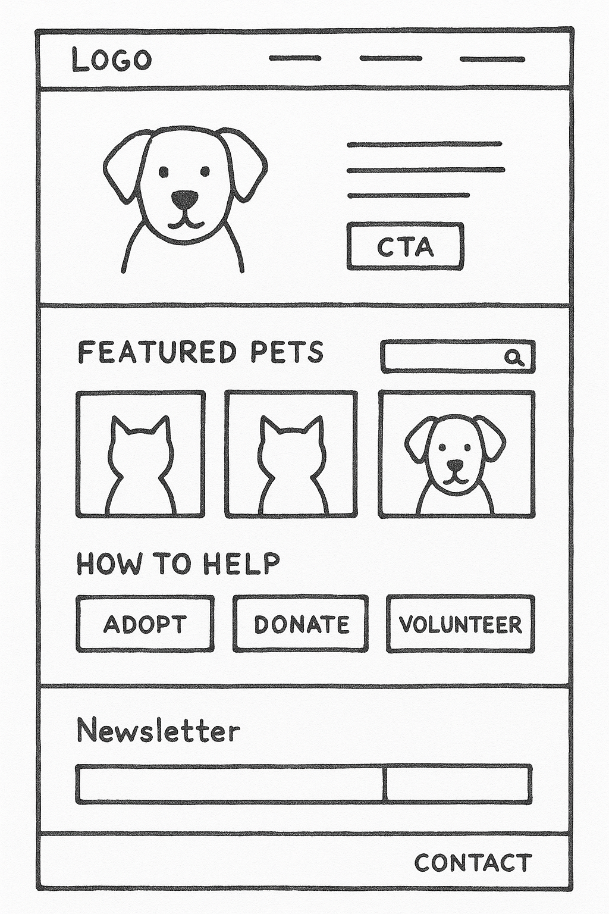

# Neptune Claws & Paws Rescue (NCPR)  
**Proposal for WEDE502POE**  
**Author:** Iviwe Bakaqana (ST10485686)  

---

## Overview
Neptune Claws & Paws Rescue is a hypothetical non-profit organisation dedicated to rescuing, rehabilitating, and rehoming abandoned cats and dogs in the Johannesburg area.  

Our mission is to provide a safe haven for animals in need and help them find forever homes.  
We operate primarily through a foster network and rely on donations and volunteers. Partnerships with veterinary clinics, sponsors, and animal shelters will ensure proper care for our animals.  

---

## Objectives

**Primary Goal:**  
- Achieve 10 qualified adoptions and 5 foster applications per week.  

**Secondary Goals:**  
- Increase online donation revenue by **25% within 6 months**.  
- Receive **10+ adoption applications per week** via the website.  
- Grow the newsletter subscriber list by **500 within 3 months**.  

---

## Current Website Analysis
- Current presence: **Facebook page** with irregular updates and an **Instagram account** showcasing pets.  
- Issues:  
  - Lack of a professional website reduces trust.  
  - Potential adopters cannot browse animals or access adoption info easily.  
  - No secure donation system → a barrier for supporters.  

---

## Planned Website Features
- **Home Page:** Hero section with call-to-actions ("Adopt", "Donate"), urgent cases, quick links.  
- **Meet the Pets:** Filterable gallery (species, age, size) with pet profiles.  
- **Forms:** Online applications for adoption, fostering, volunteering, and donations.  
- **Blog/News:** Success stories & events.  
- **Contact Page:** Form, address, email, and social links.  
- **Donation System:** Secure payment gateway (PayPal, EFT).  

---

## Target Audience
- Animal lovers (adoption)  
- Empty nesters (30–56 age group)  
- Families with pet experience  
- Students (CV building opportunities)  
- Retirees (volunteering)  
- Philanthropists (donors)  
- Homeowners  

---

## Design & User Experience
- **Colours:**  
  - Dark Teal `#336E7B`  
  - Light Blue `#C5EFF7`  
  - Green `#26A65B`  
  - Orange `#E67E22`  

- **Typography:**  
  - *Open Sans* (body text)  
  - *Lora* (headings)  

- **Layout & UX:**  
  - Clean, image-focused, simple navigation.  
  - Large, colourful CTA buttons.  
  - Mobile-first responsive design.  
  - Streamlined online forms for quick completion.  

---
### Wireframe Sketch
The following wireframe sketch illustrates the planned homepage layout with a hero section, featured pets, donation/volunteering options, newsletter, and contact section:

### Sitemap
The sitemap below represents the planned structure of the Neptune Claws & Paws Rescue website, covering adoption, volunteering, donations, blog/news, contact forms, and more:

## Technical Requirements
- **Domain:** www.pawsandclaws.org.za  
- **Hosting:** Xneelo (Linux hosting package)  
- **Languages:** HTML5, CSS3, JavaScript  
- **Framework/CMS:** WordPress or Hugo (for easy updates)  

---

## Timeframe & Milestones

| Week | Milestone |
|------|------------|
| Week 1 | Project Planning & Content Gathering |
| Week 2 | Wireframing & Design Approval |
| Week 3 | Development (Home & About pages) |
| Week 4 | Development (Forms, Gallery, JavaScript Features) |
| Week 5 | Testing, Debugging, Browser Compatibility |
| Week 6 | Final Review & Submission |

---

## Budget (Estimated ZAR)

| Item | Cost | Frequency |
|------|------|-----------|
| Domain Registration | R150.00 | Per Year |
| Web Hosting | R1,200.00 | Per Year |
| SSL Certificate | R0.00 (included) | Per Year |
| **Total Annual Cost** | **R1,350.00** | |

---

## Conclusion
The Neptune Claws & Paws Rescue website will significantly improve adoption rates, donations, and volunteer sign-ups by providing a professional, user-friendly platform. This will build trust, enhance community engagement, and ultimately help more animals find loving homes.  

---

## Reference List  

1. Coolors.co, 2023. *Color Palette Generator*. Used for generating the accessible colour palette. Available at: [https://coolors.co/](https://coolors.co/) [Accessed 21 August 2025].  
2. Google Fonts, 2023. *Open Sans & Lora*. Available at: [https://fonts.google.com/](https://fonts.google.com/) [Accessed 21 August 2025].  
3. Xneelo, 2023. *Shared Hosting Packages*. Used for benchmarking hosting requirements and costs. Available at: [https://xneelo.co.za/hosting/web-hosting/](https://xneelo.co.za/hosting/web-hosting/) [Accessed 21 August 2025].  
4. Nielsen Norman Group, 2021. *Donation Usability: Increasing Online Giving to Non-Profits and Charities*. Used for research on best practices for donation forms.  
5. ActiveCollab, n.d. *Budget Estimation*. Available at: [https://activecollab.com/blog/project-management/cost-estimation-and-budgeting](https://activecollab.com/blog/project-management/cost-estimation-and-budgeting) [Accessed 21 August 2025].  
6. GlooMaps, n.d. *Sitemap for Website Structure*. Available 
